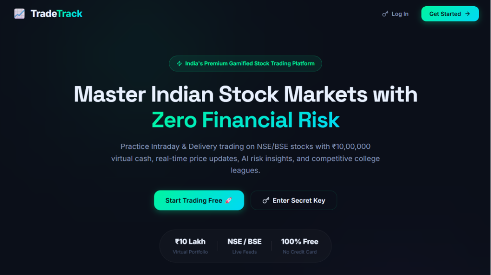

# 📈 TradeTrack - Gamified Indian Stock Trading Platform

[](LICENSE)
[](https://react.dev/)
[](https://nodejs.org/)
[](https://www.mongodb.com/cloud/atlas)
[](https://vercel.com/)

TradeTrack is a modern, gamified virtual stock trading platform tailored for Indian stock markets (NSE & BSE). Practice Intraday and Delivery trading with **₹10,00,000 in virtual cash**, real-time live price feeds, portfolio tracking, and competitive college leaderboards with zero financial risk.

---

## 🌟 Interface Preview



---

## ✨ Key Features

* 🚀 **Real-Time Indian Stock Market Prices**: Live quote updates for major NSE/BSE stocks (RELIANCE, TCS, INFY, HDFCBANK, ICICIBANK, TATAMOTORS) and market indices (NIFTY 50, SENSEX, NIFTY BANK, NIFTY IT).
* 💰 **Virtual Cash Portfolio**: Practice trading with ₹10,00,000 in paper money. Test strategies in Intraday or Delivery modes.
* 📊 **Dynamic P&L & Sector Allocation**: Automatic real-time accounting of total net worth, active stock holdings, realized/unrealized profit & loss, and sector allocation breakdown.
* 📈 **Interactive Interactive Charts**: Powered by Recharts for historical price trend analysis across multiple timeframes (1D, 1W, 1M, 3M, ALL).
* 🏆 **Gamified XP & National Leaderboard**: Earn XP on trades, track daily login streaks, unlock achievement badges, and climb college leaderboards.
* 🔐 **Privacy-First Secret Key Auth**: Simple 12-character secret key authentication format (`TT-XXXX-XXXX`) without passwords or JWT tokens.
* 🗑️ **1-Click Account & Data Reset**: Instantly wipe your profile, stock positions, and transaction history from MongoDB Atlas.
* 📑 **CSV Trade History Export**: Download complete order execution logs in 1-click CSV format for performance auditing.

---

## 🛠️ Technology Stack

| Layer | Technologies |
| :--- | :--- |
| **Frontend** | React 19, Vite, Framer Motion, Recharts, Lucide Icons, Vanilla CSS Design System |
| **Backend** | Node.js, Express.js, Axios, Mongoose |
| **Database** | MongoDB Atlas (Cloud Database) |
| **Market Data** | Yahoo Finance Live API Engine (Zero API Key Required) |
| **Deployment** | Vercel (Frontend & Serverless Functions) |

---

## 📂 Project Structure

```text
TradeTrack/
├── api/                   # Vercel Serverless Functions entrypoint
│   └── index.js
├── public/                # Static assets & public preview images
│   └── banner.png
├── server/                # Express Backend Server
│   ├── models/            # Mongoose Schemas (User, Holding, Transaction)
│   ├── routes/            # API Endpoints (user, market, trade, portfolio, leaderboard)
│   ├── .env.example       # Backend environment configuration template
│   └── server.js          # Express server setup & MongoDB connection
├── src/                   # React Frontend Source
│   ├── assets/            # UI images & icons
│   ├── components/        # Reusable UI components (Sidebar, TickerTape)
│   ├── data/              # Market data constants & rank utilities
│   ├── pages/             # Page views (LandingPage, Dashboard, Markets, Trade, Portfolio, Leaderboard, Battles, Learn)
│   ├── App.jsx            # Main app container & routing
│   └── main.jsx           # React DOM entrypoint
├── LICENSE                # MIT License
├── package.json           # Frontend package dependencies
└── vercel.json            # Vercel deployment configuration
```

---

## 🚀 Getting Started Locally

### Prerequisites
* **Node.js**: v18.0.0 or higher
* **npm**: v9.0.0 or higher
* **MongoDB Atlas**: Free cluster URI (or local MongoDB daemon)

### 1. Clone Repository
```bash
git clone https://github.com/Abk700007/TradeTrack.git
cd TradeTrack
```

### 2. Install Dependencies
```bash
# Install frontend dependencies
npm install

# Install backend dependencies
cd server
npm install
cd ..
```

### 3. Environment Setup
Create a `.env` file inside the `server/` directory:
```env
PORT=5000
MONGODB_URI=mongodb+srv://<username>:<password>@cluster.mongodb.net/tradetrack?retryWrites=true&w=majority
```

### 4. Start Development Server
```bash
# Terminal 1: Run Express Backend Server
cd server
npm run dev

# Terminal 2: Run React Frontend (Vite)
npm run dev
```

Open `http://localhost:5173` in your browser.

---

## ☁️ Deployment to Vercel

TradeTrack is pre-configured for seamless single-click deployment on **Vercel**:

1. Push code to your GitHub repository.
2. Import the repository into your Vercel Dashboard.
3. Add the environment variable `MONGODB_URI` under **Settings -> Environment Variables**.
4. Click **Deploy**. Vercel will build the React bundle and deploy `/api/index.js` as serverless API functions automatically.

---

## 📜 License

This project is open-source software licensed under the **[MIT License](LICENSE)**.
